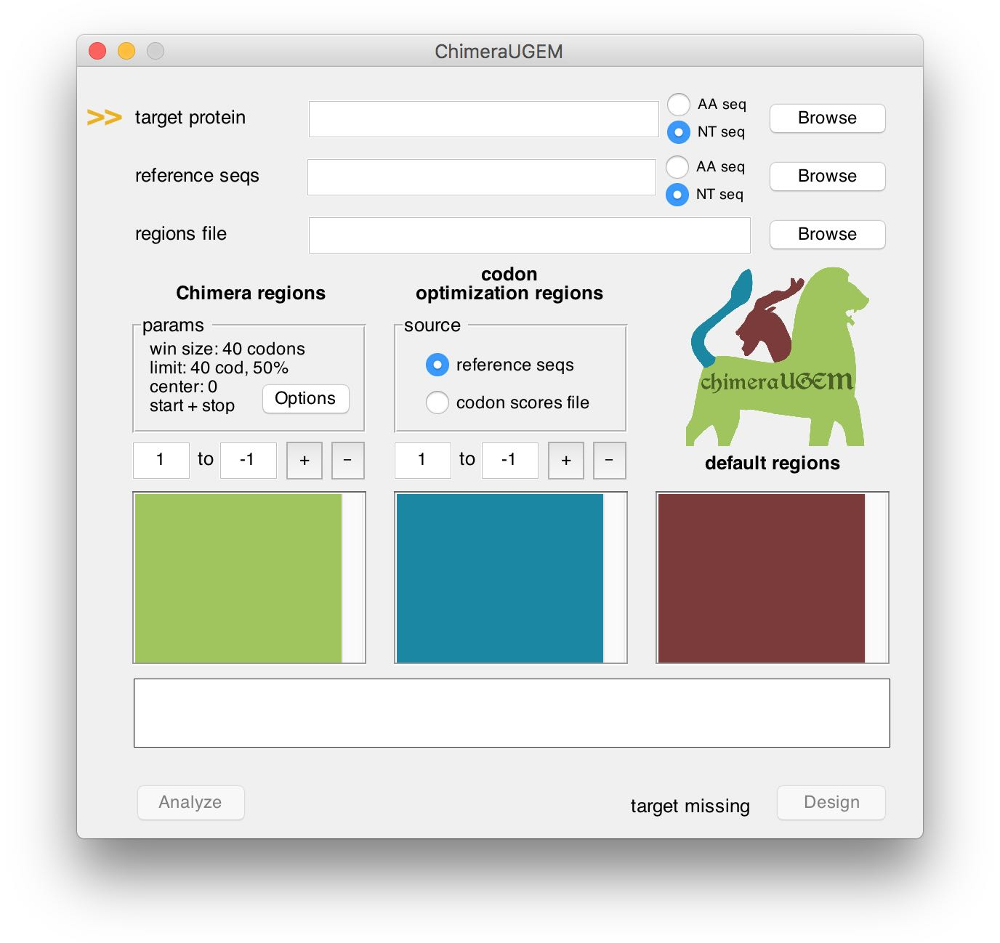
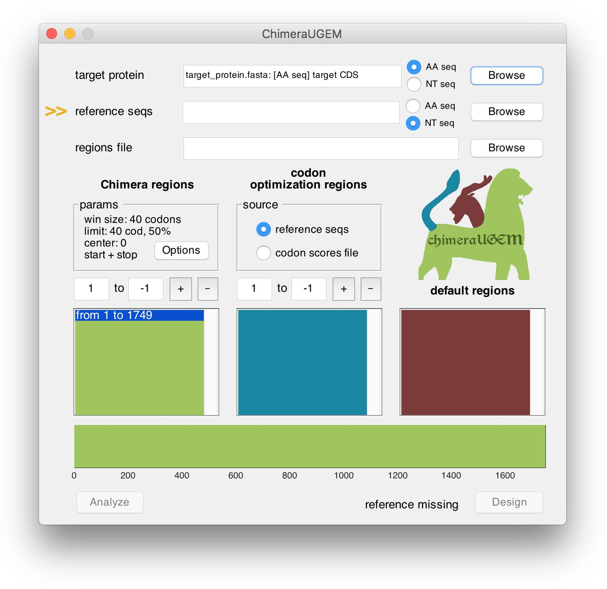
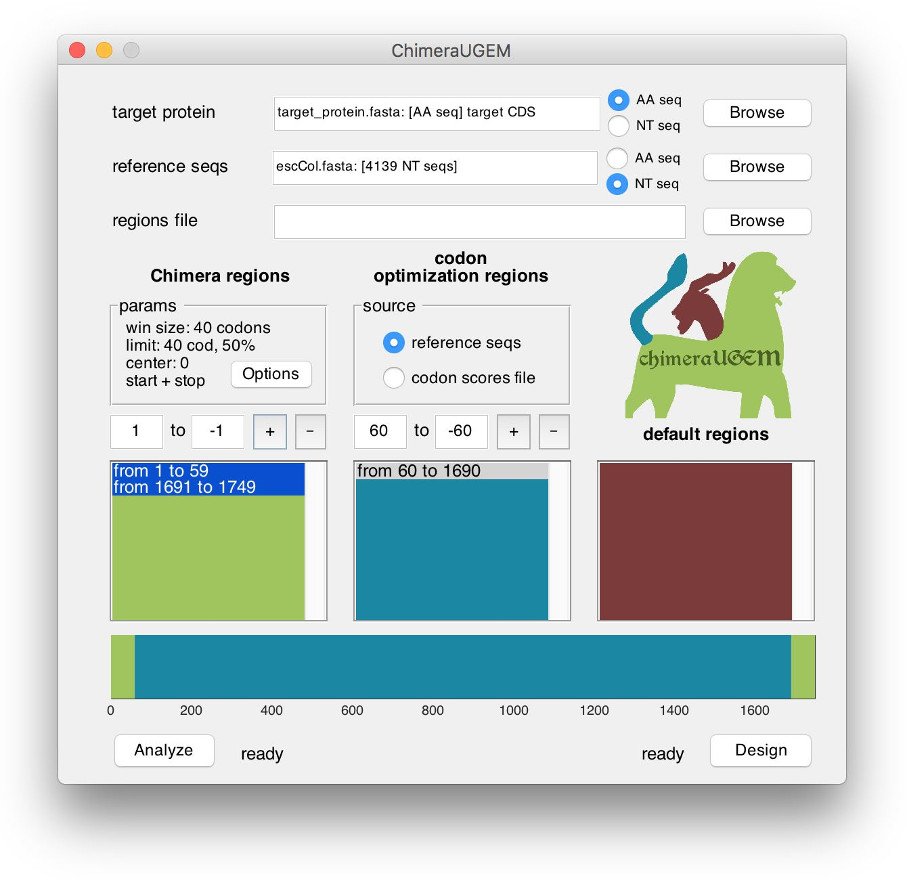
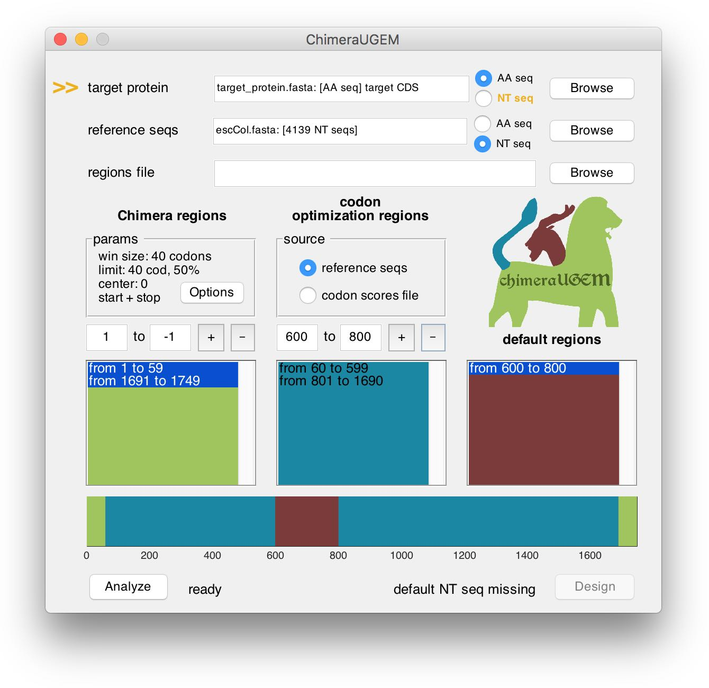
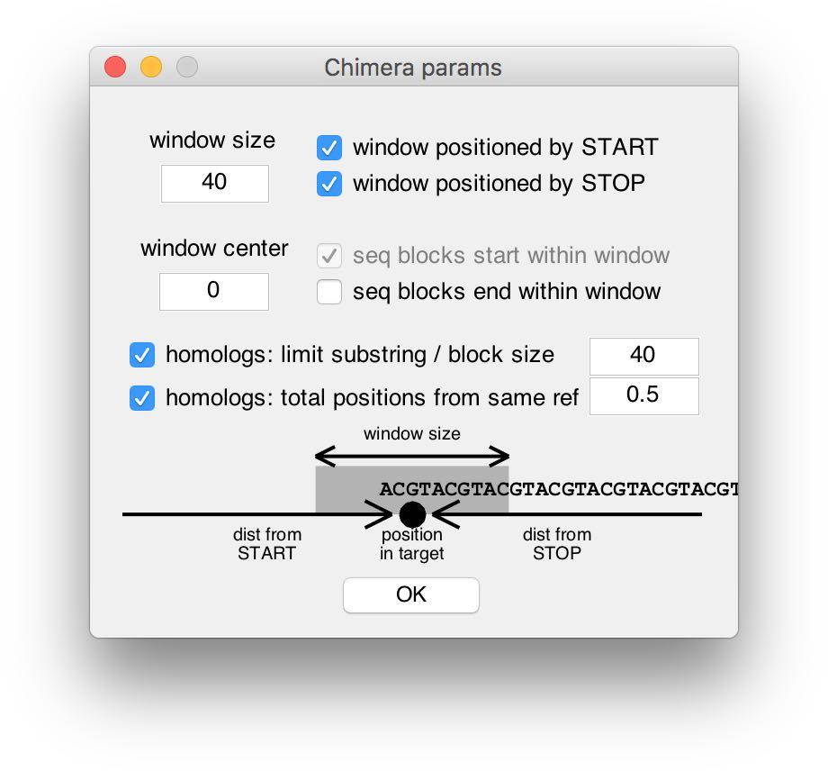
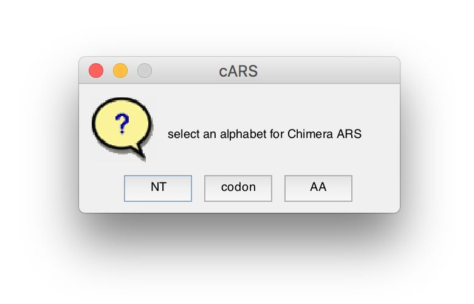

# ChimeraUGEM
### Unsupervised Gene Expression Modeling

## How to cite

Diament et al. **ChimeraUGEM: unsupervised gene expression modeling in any given organism**. pre-print, 2018.

## Download

The ChimeraUGEM binaries and source code are provided freely for non-commercial use.

* [v1.0-macOS](https://github.com/alondmnt/chimera/releases/download/v1.0/ChimeraUGEM-v1.0-macOS.zip)
* [v1.0-Linux](https://github.com/alondmnt/chimera/releases/download/v1.0/ChimeraUGEM-v1.0-linux.zip)
* [v1.0-Windows](https://github.com/alondmnt/chimera/releases/download/v1.0/ChimeraUGEM-v1.0-win.zip)
* [v1.0-source](https://github.com/alondmnt/chimera/archive/v1.0.zip)
* [github repository](http://github.com/alondmnt/chimera/)

### Release notes

#### Version 1.0

* Implementation of the analysis pipeline: cARS, PScARS, and CAI.
* Homolog filters.
* Improved performance.
* Improved error handling.

#### Version 0.9

* Implementation of the design pipeline: cMap, PScMap, and codon optimization.
* First full distribution (binaries, docs, website).

##  User guide

ChimeraUGEM provides tools for the analysis of gene sequences (coding and non-coding), as well as the design of proetin coding sequences for optimized expression, based on the Chimera algorithms (Zur and Tuller, 2015; Diament et al., 2018) and codon usage optimization. The following tutorial will guide you step-by-step through the analysis and design pipelines. The application also provides online hints and status messages for the user. For an in-depth description of the methods (and some interesting results!) see the original paper.

|Abbreviation   |Description    |Reference  |
|---            |---            |---        |
|CAI    |Codon Adaptation Index |(Sharp and Li, 1987)|
|cARS   |ChimeraARS (part of the analysis pipeline)  |(Zur and Tuller, 2015)|
|cMap   |ChimeraMap (part of the design pipeline)    |(Zur and Tuller, 2015)|
|PScARS |Position-Specific cARS |(Diament et al., 2018)|
|PScMap |Position-Specific cMap |(Diament et al., 2018)|

[1. Target selection](#target)

[2. Reference set selection](#ref)

[3. Region definition](#reg)

[4. Additional parameters](#params)

[5. Output files](#output)

[6. Batch processing](#batch)

###  1. Target selection <a href="#guide">^</a>

ChimeraUGEM supports fasta files containing nucleotide or amino acid sequences. Select the appropriate alphabet type (AA seq / NT seq), and then click on 'Browse' to select your file. When the fasta file contains multiple proteins, a window will pop-up in order to select the desired ones for analysis or optimization. You may select a single or multiple proteins. While most of the following steps are applicable to both scenarios, batch processing will be discussed in detail at the end of the tutorial.

The program will prompt when illegal chars appear in the sequence(s), it contains partial codons, or missing a stop codon. It will also alert when some of the chars do not appear in the reference set at all.

As long as a target has yet to be selected, an arrow will point at the target protein field and a 'target missing' status will appear at the bottom right corner of the window.

Note, that NT seq targets can be used to define - in addition to the amino acid sequence - regions where the given sequence will be copied into the designed gene (additional details appear below).

###  2. Reference set selection <a href="#guide">^</a>

ChimeraUGEM supports fasta files containing multiple nucleotide or amino acid sequences. (The latter alphabet is only applicable to the _analysis_ pipeline.) The given reference sequences may be used in 2 ways:

* Search for the longest sub-sequences in the reference set that:
    * (_analysis_)  are idenitcal to a sub-sequence in the target, and compute the Average Repetitive Substring length (via the cARS and PScARS algorithms).
    * (_design_)    encode an identical block of amino acids in the target protein (via the cMap and PScMap algorithm).
* Learn the codon usage bias (CUB) in the reference set and:
    * (_analysis_)  compute the Codon Adaptation Index (CAI) score.
    * (_design_)    optimize (maximize) the CUB/CAI in the target protein.

The program will prompt when illegal chars appear in the sequences, when they contain partial codons, or when target chars are missing from the reference.

As long as a reference set has yet to be selected, an arrow will point at the reference seqs field and a 'reference missing' status will appear at the bottom right corner of the window.

An index of the reference sequence will be generated when analysis or design are initiated. Note, that this may take a few minutes for a very large reference. (For example, ~20min for 85k human transcripts.) 

### 3.  Region definition <a href="#guide">^</a>

The analysis pipeline computes 2 global scores over the entire target sequence (ARS, and CAI), as well as 1 (optional) ARS score that is calculated over a defined "Chimera region" in the gene.

The design pipeline enables the user to combine the 3 approaches described above (ChimeraMap, codon usage bias, and pre-defined NT sequences) by associating regions in the target protein with each method.

When a target sequence is first selected, a "Chimera region" is automatically set to apply to the entire target. If you are only interested in using any of the Chimera algorithms, there is no need for further action.

####  3.1 Regions editor

The bottom half of the window displays region definitions for the currently analyzed or designed target. **Region coordinates are measured in codons.** (Please note this when analyzing non-coding sequences.) Regions are listed in three separated columns, according to the associated method. At the bottom, a horizontal bar displays a map of the target gene, with positions colored according to the method that will apply to them (green: Chimera, blue: codon usage bias, red: pre-defined sequence).

To add a new region, edit the text boxes in the respective column with the desired codon coordinates, and click on the '+' button. Note, that positive coordinates (such as 60cod in the example below) are measured relatively to the 5'-end of the sequence, while negative coordinates (such as -60cod in the example) are measured relatively to the 3'-end of the sequence (-1 being the last codon).

In practice, the design pipeline handles multiple region types by optimizing the complete target gene accroding to each method. Next, sub-sequences are copied from the two optimized genes (and the third source, if applicable). Therefore, it is possible that a ChimeraMap block will be splitted during this process, if it overlaps with a region boundary.

The program will prompt for user action when an added region is overlapping with an existing region. In the example above, the previously defined Chimera region from 1 to 1749 was split, and a codon optimization region was inserted from 60 to 1690 (the position that is 60cod from the target 3'-end).

To remove a region, edit the text boxes, and click on the '-' button. You may also click the list boxes and the regions map to select a region and update the respective text boxes with its boundaries. A removed region will be defined as 'default' (copied from a pre-defined NT sequence, see the example below).

Note, that when a default region is defined (and a target NT sequence is required), the program will prompt for missing target sequences next to the _Design_ button. However, the _analysis_ pipeline will remain available. In the example above we provided an AA sequence for the target, so when a default region was created from 600 to 800, an arrow appeared next to the target protein field, and the status below showed 'default NT seq missing'. This can be ammended either by selecting a target NT seq, or by replacing the default region with either a ChimeraMap or a CUB region.

####  3.2 Regions file

This feature allows one to skip the manual definition of regions (as described above). ChimeraUGEM supports fasta files (denoted with the extension '.reg') containing sequences comprised of the letters **B** (for Chimera **B**locks), **C** (for **C**UB), and **D** (for **D**efault). The header (as well as length) of each record in the regions file should match one of the records in the target protein fasta. Each letter defines which of the methods will be applied to the corresponding codon position in the analyzed or designed gene.

### 4.  Additional parameters <a href="#guide">^</a>

#### 4.1 Chimera parameters

Chimera parameters are summarized in a panel above the Chimera regions column. The default parameters were selected in the original paper, and generally do not strongly affect the final result (see the paper of analysis and discussion). However, they can be edited by clicking on the 'options' button, which opens a new window.

The top half of the parameters window contains parameters that affect the _search window_ of the Chimera algorithms. There, parameters can be edited and their effect on the search window is visualized (at the bottom). In order to use the traditional (non-position-specific) cARS or cMap algorithms, one can enter 0 in the window size field.

The 2 _homolog filters_ at the center of the window enable optional heuristic-based filters. Their objective is to ignore reference sequences that are too similar to the target, and therefore may introduce bias into the repetitive substring search. For example, when the filters are off, if a sequence in the reference set were to be almost identical to the target, the computed ARS score would be very high without capturing any reference-wide information content that may relate to gene regulation. Moreover, the design pipeline would duplicate the gene almost in its entirety. Therefore, in a scenario where this behavior is not desireable, the two filters may be calibrated by the user according to the analysis context. It is worth noting that reference sequences detected by the filters are only ignored during the processing of a particular target, and are still a valid reference for the rest of the targets. (Additional details appear in the Supplementary Methods of the original paper.)

#### 4.3 Alphabet selection

cARS and PScARS can be computed using different alphabet representations of the given sequences. When the analysis process begins, and if alphabets other than amino acids (AA) are availbale (based on the given target and reference representations), the user will be prompted to select one.

#### 4.3  Codon parameters

Codon parameters are set in a panel above the codon regions column. Codons can be scored and optimized based on two souces:

* The reference set (discussed above).
* A user-defined table of codon optimality scores.

For the second method, ChimeraUGEM supports comma-separated (.csv) files. During analysis, the geometric mean of the codon weights (scores) is computed. During design, synonymous codons with the highest optimality score will be used to encode the target protein. Codons with equal maixmal score will be drawn uniformly. The program will prompt when some AAs are not represented in the given table.

### 5.  Output files <a href="#guide">^</a>

#### Analysis

ChimeraUGEM generates two types of outputs:

* A summary table, in '.csv' (comma-separated values) format, of final scores per target sequence, containing: the target name, total cARS/PScARS score, the score in a subset of the target defined by a "Chimera region", and a codon-based score (see [section 4.3](#codon_score)).
* A detailed output, in '.csv' format, of vectors of repetitive substring lengths at each position in the target(s). The first value in each row contains the target name, and the rest of the values contain substring lengths from 5' to 3' in the defined "Chimera region". Rows may have varying lenghts.

#### Design

ChimeraUGEM generates two types of outputs:

* Fasta file containing the designed target gene(s).
* Report file for each of the target genes (separately) in '.csv' (comma-separated values), containing information on the different optimization regions. Specifically, ChimeraMap blocks are reported in the file. Note, that if a region boundary overlapped with a ChimeraMap block (see [section 3.1](#reg-edit)), the complete block will be reported, although it was split when the final gene was constructed. For example:

pos_s |pos_e |type               |gene   |gene\_loc |block        |
------|------|-------------------|-------|----------|-------------|
1     |10    |codon: eColi.fasta |       |NaN       |             |
9     |12    |cMap               |MEPS   |14        |GGGATTCCCGCG |

The table reports that the first 10 codons were optimized based on codon frequencies in E. coli, while codons 11-12 were taken from a cMap block beginning at codon 9 in the target protein (and beginning at codon 14 in the reference gene MEPS).

### 6.  Batch processing <a href="#guide">^</a>

ChimeraUGEM supports batch processing of multiple target sequences. One may select any number of targets from the fasta file in [section 1](#target). The rest of the workflow is similar, with the exception that the regions editor is not enabled when multiple targets are given. If the analysis or design is based exclusively on Chimera methods, there is no need for further action. Otherwise, region definitions must be provided via a regions file as described in [section 3.2](#reg-file).
